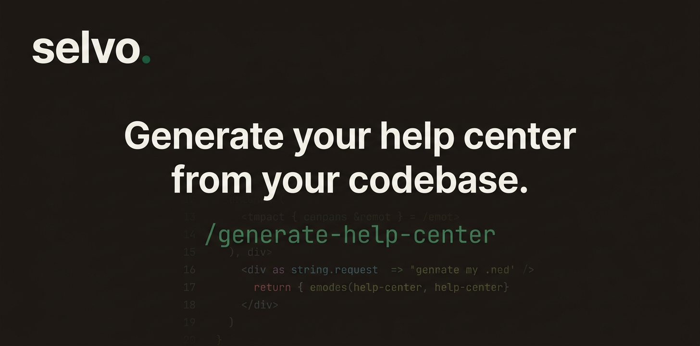

Generate and maintain help center articles from your codebase.

## Quick start

### 1. Install skills

```bash
# All agents (Claude Code, Codex, Cursor, Windsurf, Gemini CLI, etc.)
npx skills add selvoapp/skills
```

<details>
<summary>Other install methods</summary>

**Claude Code plugin:**
```
/plugin marketplace add selvoapp/skills
/plugin install selvo-help-center@selvo
```

**Manual:**
```bash
git clone https://github.com/selvoapp/skills ~/.claude/skills/selvo
```

</details>

### 2. Connect Selvo MCP

**Claude Code:**
```bash
claude mcp add --transport http selvo https://app.selvo.co/mcp \
  --header "Authorization: Bearer YOUR_API_KEY"
```

**Cursor / Windsurf:** Add the MCP server in Settings > MCP with the URL `https://app.selvo.co/mcp` and your API key as a Bearer token header.

Get an API key from **Settings > API Keys** in your [Selvo dashboard](https://app.selvo.co).

### 3. Generate your help center

```
/generate-help-center
```

## Skills

| Skill | Command | Description |
|-------|---------|-------------|
| [generate-help-center](skills/generate-help-center/) | `/generate-help-center` | Reads your codebase and creates structured help articles organized into collections |
| [update-help-center](skills/update-help-center/) | `/update-help-center` | Detects stale docs after code changes and surgically updates only what changed |


### /generate-help-center

Reads your README, routes, config, and APIs. Creates structured articles organized into collections with proper content hierarchy. All articles are created as drafts for your review.

```
/generate-help-center
/generate-help-center billing and API docs
```

### /update-help-center

Three-phase pipeline: detect code changes, match to existing articles, decide what to update. Supports surgical section-level edits, dry-run mode, and rejection memory.

```
/update-help-center
/update-help-center --since "1 week ago"
/update-help-center --dry-run
/update-help-center --full-scan
```

## CI/CD templates

Automate documentation maintenance with GitHub Actions:

| Workflow | Trigger | Description |
|----------|---------|-------------|
| [sync-docs.yml](workflows/sync-docs.yml) | Push to `docs/help-center/` | Sync markdown files to Selvo |
| [changelog.yml](workflows/changelog.yml) | GitHub release published | Create help center article from release notes |
| [doc-drift.yml](workflows/doc-drift.yml) | PR merged to main | Check for stale docs and update them |

## Requirements

- A [Selvo](https://selvo.co) account (Starter plan or above)
- An API key from Settings > API Keys
- An MCP-compatible AI agent (Claude Code, Codex, Cursor, Windsurf, etc.)

## License

MIT
